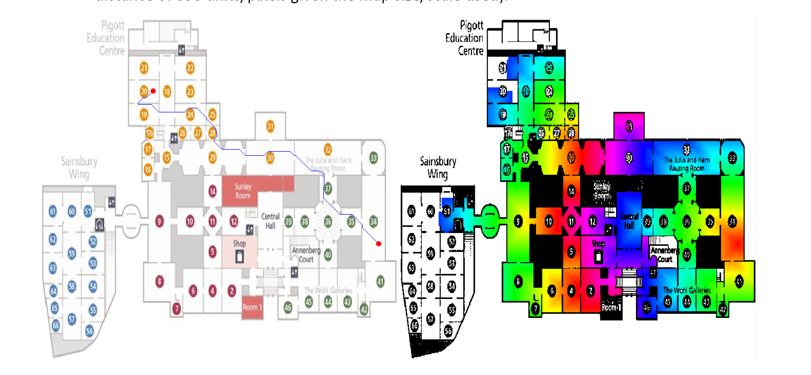

# Data Structures and Algorithms 2
## CA Exercise 2 – National Gallery Route Finder
**“Create a route finder for the main floor of the National Gallery, London.”**

The objective of this team CA exercise is to create a JavaFX application that can search for and retrieve routes between points/rooms/exhibits on the main floor (https://www.nationalgallery.org.uk/visiting/floorplans/level-2) in the National Gallery in London given a starting point/room/exhibit and a destination.

The application should generate the following on request:

- **Multiple route permutations** between a starting point/room/exhibit and a destination (can limit to a maximum user‑specified number).
    - Must use **depth‑first search (DFS)**.
- **Shortest route** (in terms of distance) between the starting point/room/exhibit and destination:
    - Using **Dijkstra’s algorithm**.
    - Using **breadth‑first search (BFS)**.
- **Most interesting route**, based on a list of preferred artists:
    - Using **Dijkstra’s algorithm** again.

The application should also allow users to:

- Specify **rooms/exhibits to avoid**.
- Specify **rooms/exhibits that must be visited** along the way.

A suitable map/floorplan of the main floor should be used (edited/recoloured as needed).  
Lines, markers, labels, thumbnails, etc. may be added visually to display the route(s) on the map.

---

## Implementation Notes

- This is a **team exercise** (2–3 students; solo work requires lecturer approval).
- This CA is worth **35%** of the overall module mark.  
  Submission via Moodle and an in‑person demo/interview are **mandatory**.

### Graph Requirements

- Use **graphs** where:
    - Rooms = **nodes/vertices**
    - Doorways/corridors = **links/edges**

- Example:
    - Room 60 connects to rooms 51, 59, and 61.
    - Room 59 connects to rooms 53, 58, and 63.
    - A valid route from 60 to 53 is: `60 → 59 → 53`.

- Rooms store **art exhibits**.  
  Using an exhibit as start/destination = referencing the room containing it.

- Implement your **own custom graph data structure** first.  
  You may additionally use any **JCF collections/classes**.

### Database Requirements

- Use a **database file** containing many rooms and exhibits.
- Can be any format: **CSV**, **XML**, **plaintext**, etc.
- No need to save back to file.
- Should be easy to update manually.

Useful resource:  
https://www.nationalgallery.org.uk/visiting/floorplans/level-2

### JavaFX Requirements

Your GUI should include:

- User‑friendly layout
- Visual map feedback (lines between rooms, labels, highlights)
- Optional:
    - **TreeView** for expandable route display
    - Scrollable exhibit images along a route
    - Any additional JavaFX controls

### Algorithm Requirements

#### Dijkstra’s Algorithm
Used for:
- Shortest route
- Most interesting route (weighted by preferred artists)

#### Breadth‑First Search (BFS)
Used for:
- Shortest route between **pixel points**

BFS runs **pixel‑by‑pixel** on a black‑and‑white map:
- White pixels = accessible
- Black pixels = blocked
- Adjacent white pixels = BFS children
- Step cost = 1
- Stops when destination pixel reached
- Final route must be drawn on the map
- Estimated pixel distance must be displayed

*Waypoints and avoid‑lists do **not** need to be supported for BFS.*

---

## Waypoints & Avoid Lists

- You can specify **one or more waypoints** that a route must visit.
    - Supported for DFS, Dijkstra, etc.
- You can specify **rooms/exhibits to avoid**.
    - Supported for all except BFS.

---

## Indicative Marking Scheme (Total 100%)

| Component | Weight |
|----------|--------|
| Custom graph data structure/classes | 10% |
| Generate any single valid route | 10% |
| Generate multiple route permutations (DFS) | 10% |
| Shortest route (Dijkstra) | 15% |
| Shortest route (BFS, with map illustration) | 15% |
| Most interesting route (Dijkstra) | 10% |
| Waypoint support | 5% |
| Avoiding specified rooms/exhibits | 5% |
| JavaFX GUI | 5% |
| JUnit testing | 5% |
| JMH benchmarking | 5% |
| General completeness, structure, commenting, logic | 5% |

> Completing all features is **not expected** — prioritise based on the marking scheme.